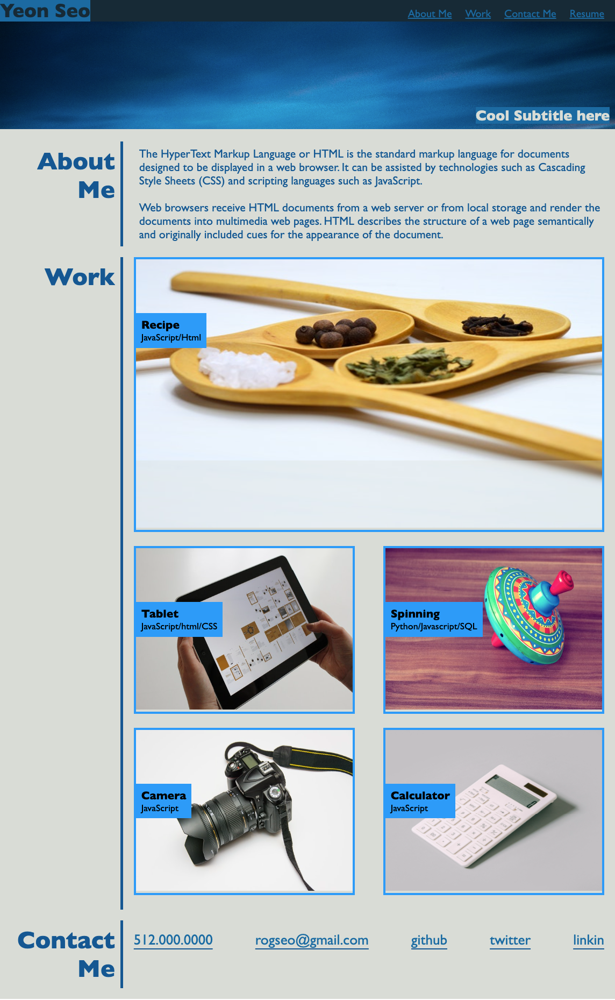
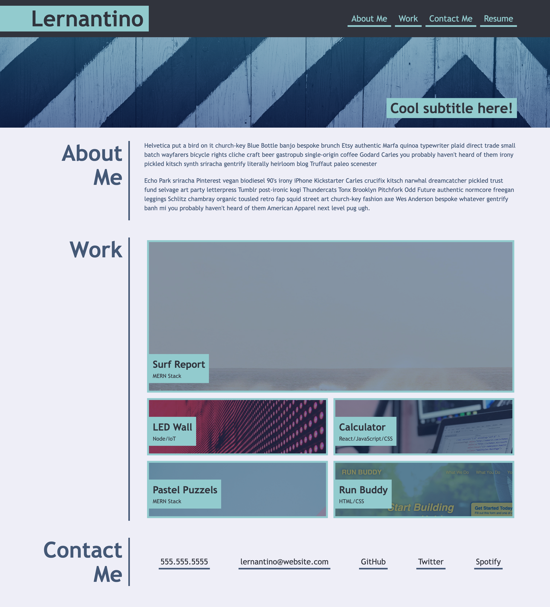

# myFirstPortfolio
* Making first Portfolio during the course of UT bootcamp.
* Trying to duplicate someone's previous work and apply what I have been learning to CSS and HTML.

## User Story
AS an employer
I want to view a potential employee's deployed portfolio of work samples
SO THAT I can review samples of their work and assess whether they're a good candidate for an open position

## Acceptance Criteria
* It is done when I load the portfolio by sampling a employee's previous work.
* It is done when I am presented with the developer's name, and links to sections about them, their work, and how to contact them.
* It is done when the links in the navigation link to the corresponding section.
* It is done when clicks of the images of the applications link to that deployed applications.
* It is doen when the first application is larger in size than the others.
* it should be a responsive layout that adapts to my viewport.

## Mock-up
The following image demonstrates the web application's appearance:

## Deployed link
https://rogseo.github.io/myFirstPortfolio/

## Note
Refer to the screenshot of someone's previous work.

